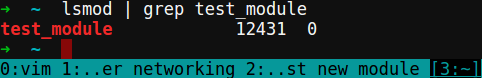
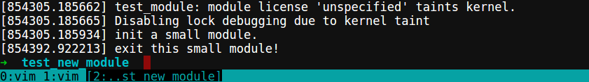

## Hands-On Exercises ## 

### [4] Use Sniffer or similar software to find out prototype ###

### [7] Write one small module. Show what commands are needed to compile and install it ###

> all Linux modules need `<linux/module.h>` and `<linux/init.h>`  
> in `<linux/init.h>` include module's init and cleanup;  
> in `<linux/module.h>` define data structure and macro about modules.  

> when add `__init` means that this func will be free after exec(init);  
> and `__exit` used to declare a function which is only required on exit: 
> the function will be dropped if this file is not compiled as a module.

> `module_init()` defines which function is to be called at module insertion time 
> (if the file is compiled as a module), or at boot time.  
> `module_exit()` defines the function to be called at module removal time 
> (or never, in the case of the file compiled into the kernel).

> when we call `insmod` to install a new module; kernel will call `module_init`  
> to set up the initial config.
> And when call `rmmod` to remove specific module; kernel will call `module_exit` 
> to remove the module.

```c
/* this is a simple module for test */
/* test_module.c */

#include <linux/module.h>
#include <linux/init.h>

static int __init test_module_init(void) {
  printk(KERN_INFO "init a small module.\n");
  return 0;
}

static void __exit test_module_exit(void) {
  printk(KERN_INFO "exit this small module!\n");
  return;
}

module_init(test_module_init);
module_exit(test_module_exit);
```

```makefile
# Makefile

module_name := test_module
obj-m := $(module_name).o

KERNELDIR := /lib/modules/`uname -r`/build

all:
  make -C $(KERNELDIR) M=$(PWD) modules

clean:
  make -C $(KERNELDIR) M=$(PWD) clean
  rm -f *.o *.mod.c *.order *.symvers
```

> `make`  // it will show below msgs

```text
make -C /lib/modules/`uname -r`/build M=/home/yehya/test_new_module modules
make[1]: Entering directory `/usr/src/linux-headers-3.13.0-66-generic'
  CC [M]  /home/yehya/test_new_module/test_module.o
  Building modules, stage 2.
  MODPOST 1 modules
  CC      /home/yehya/test_new_module/test_module.mod.o
  LD [M]  /home/yehya/test_new_module/test_module.ko
make[1]: Leaving directory `/usr/src/linux-headers-3.13.0-66-generic'
```
> and it will generate these files,

```text
modules.order  Module.symvers  test_module.ko  test_module.mod.c  
test_module.mod.o  test_module.o
```

> `insmod test_module.ko`

> `lsmod | grep test_module`  


> `rmmod`

> `dmsg`  


## Written Exercises ##


