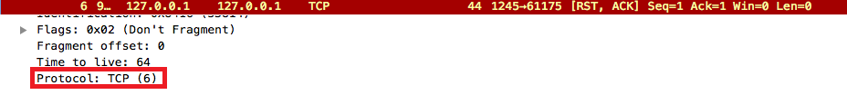
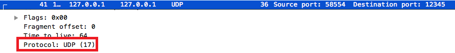
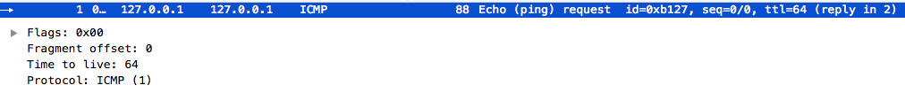

## Hands-On Exercises ##

### [4] Use Sniffer or similar software to find out prototype ###
> TCP, UDP, ICMP protocol base on IP protocol  
  
  
  

> TCP, UDP, ICMP are transport layer  
> HTTPS is application layer

### [7] Write one small module. Show what commands are needed to compile and install it ###

> all Linux modules need `<linux/module.h>` and `<linux/init.h>`  
> in `<linux/init.h>` include module's init and cleanup;  
> in `<linux/module.h>` define data structure and macro about modules.  

> when add `__init` means that this func will be free after exec(init);  
> and `__exit` used to declare a function which is only required on exit: 
> the function will be dropped if this file is not compiled as a module.

> `module_init()` defines which function is to be called at module insertion time 
> (if the file is compiled as a module), or at boot time.  
> `module_exit()` defines the function to be called at module removal time 
> (or never, in the case of the file compiled into the kernel).

> when we call `insmod` to install a new module; kernel will call `module_init`  
> to set up the initial config.
> And when call `rmmod` to remove specific module; kernel will call `module_exit` 
> to remove the module.

```c
/* this is a simple module for test */
/* test_module.c */

#include <linux/module.h>
#include <linux/init.h>

MODULE_LICENSE("MIT");
static int __init test_module_init(void) {
  printk(KERN_INFO "init a small module.\n");
  return 0;
}

static void __exit test_module_exit(void) {
  printk(KERN_INFO "exit this small module!\n");
  return;
}

module_init(test_module_init);
module_exit(test_module_exit);
```

```makefile
# Makefile

module_name := test_module
obj-m := $(module_name).o

KERNELDIR := /lib/modules/`uname -r`/build

all:
  make -C $(KERNELDIR) M=$(PWD) modules

clean:
  make -C $(KERNELDIR) M=$(PWD) clean
  rm -f *.o *.mod.c *.order *.symvers
```

> `make`  // it will show below msgs

```text
make -C /lib/modules/`uname -r`/build M=/home/yehya/test_new_module modules
make[1]: Entering directory `/usr/src/linux-headers-3.13.0-66-generic'
  CC [M]  /home/yehya/test_new_module/test_module.o
  Building modules, stage 2.
  MODPOST 1 modules
  CC      /home/yehya/test_new_module/test_module.mod.o
  LD [M]  /home/yehya/test_new_module/test_module.ko
make[1]: Leaving directory `/usr/src/linux-headers-3.13.0-66-generic'
```
> and it will generate these files,

```text
modules.order  Module.symvers  test_module.ko  test_module.mod.c  
test_module.mod.o  test_module.o
```

> `insmod test_module.ko`

> `lsmod | grep test_module`  


> `rmmod`

> `dmsg`  
  

> if not add `MODULE_LICENSE()` to specify licence that will get warning msg.  

## Written Exercises ##

(2.) Read RFC1071 and RFC1624 to see how IP checksum is computed. Practice with 
the trivial blocks of words by hand.  
0x36f7    0xf670    0x2148   0x8912   0x2345  0x7863  0x0076  
What if the first word above is changed into 0x36f6?  
RFCs downloaded from https://www.ietf.org/rfc.html

> **[ans]**  
> 1. 0x36f7 + 0xf670 + 0x2148 + 0x8912 + 0x2345 + 0x7863 + 0x0076 = 000273df  
0002 + 73df = 73e1, 1's Complement -> 0x8C1E  
> 2. 0x36f6 + 0xf670 + 0x2148 + 0x8912 + 0x2345 + 0x7863 + 0x0076 = 000273de  
0002 + 73de = 73e0, 1's Complement -> 0x8C1F

-----

(5.) What are the advantages and disadvantages if we make the minimum Ethernet 
frame larger?  

> **[ans]** Ethernet frame is data link layer  
> advantage: if minimum Ethernet frame too short, the collisions might not be
> detected by sender. NICs sending data and sniffing media at same time, if it 
> get different signal when it was sending data that collision was happened.  
>  
> disadvantage: if minimum Ethernet frame is too large, overhead of sending a frame 
> will be too high.

-----

(7.) Should a switch recompute a new FCS of an incoming frame before it is 
forwarded?

> **[ans]**  
> this idea is bad, because  
> 1. it will increase redundant time cost.  
> 2. if swicth detected and claimed this frame is correct, then ruined it internal 
> switch, after forwarding next node would never know this frame is incorrect.

-----

(13.) Suppose bit stuffing with 0 is used after 5 consecutive 1's. Assuming the 
probabilities of 0's and 1's in the bit stream are equal and the occurrences 
are random, what is the transmission overhead of the bit stuffing scheme? 
(Hint: Formulate a recursive formula f(n) to find the expected number of 
overhead bits in an n-bit string first.)

> **[ans]**  
> [0.5 * f(n-1) + 0.5^2 * f(n-2) + 0.5^3 * f(n-3) + 0.5^4 * f(n-4) + 0.5^5 * f(n-5) + 0.5^5 * (f(n-6) + 1)]/n

-----

(15.) In 1000BASE-X, a frame of 64 bytes is first block coded with 8B/10B 
before transmitting. Suppose the propagation speed is 2x10^8. What is the frame 
'length' in 'meter' (Suppose the cable is 500 m long.)

> **[ans]**  
> a frame = 64(byte) * 8 = 512 bit  
> a frame encode with 8B/10B = 512 / 8 * 10 = 640 bit  
> in 1000BASE-X bandwidth(bit rate) = 1 gig bit = 10^9 bit/s  
> trans 1 bit need = 1 / 10^9 s/bit  
> 640 / 10^9(s) * 2 * 10^8(m/s) = 128m  

-----

(18.) A CPU executes instructions at 800 MIPS. Data can be copied 64 bits at a 
time, with each 64-bit word copied costing six instructions. If an incoming 
frame has to be copied twice, how much bit rate, at most, of a line can the 
system handle? (Assume that all instructions run at the full 800-MIPS rate.)

> **[ans]**  
> a frame need: 6 * 2 / (800 * 10^6) sec  
> 64 / [6 * 2 / (800 * 10^6)] = 4.26667 * 10^9 (bit/sec)

-----

(20.) What is the probability that one out of 100 frames of 1000 bytes suffers 
from an error on average if the bit error rate is 10^-8?

> **[ans]**  
> p(no error) = (1 - 10^-8)^(1000 * 8 * 100)
> at least an error = 1 - p(no error) = 0.007968085242498368

(others)  
What is the maximum number of frames a switch of 16 Fast Ethernet (100 Mb/s) 
ports may deal with if each port operates in full-duplex mode?  
**[ans]**  
> Fast Ethernet has a interframe gap (IFG): to prepare for anothor package,
in Fast Ethernet it is 12 byte
> 100 * 10^6 * 16 / (64 * 8 + 96 + 8 * 8) = 2380952 (frames)

