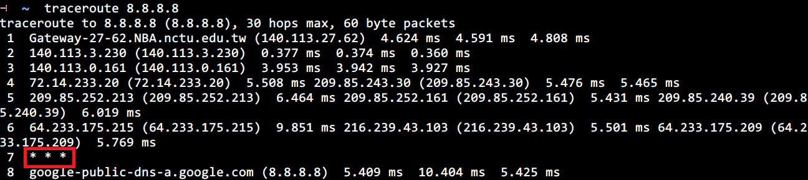

## Hands-On Exercises ##

(2) Use Wireshark or similar software to capture packets for couple seconds. 
Find an ARP packet and IP packet. 
Compare the difference between the MAC header of these two packets.  
* Can you find the protocol ID for ARP and IP?  
* Is the destination address of the ARP packet a broadcast address or unicast 
address? 
* Is this ARP packet a request or reply packet? Examine the payload of this ARP 
packet.

**[ans]**  
> * protocol type:
>   * ARP: 0x0806
>   * IP: 0x0800
> * ARP **request** is a `broadcast packet` with destination MAC address of 
FF:FF:FF:FF:FF:FF which is accepted by all computers  

> * ARP **reply** is an `unicast packet`  

-----

(6) Use virtual route or traceroute to find out the infrastructure of your domain 
and routes to foreign countries.  

**[ans]**  
> * All implementations of traceroute rely on ICMP (type 11) packets being sent to 
the originator.  
> * It starts probes with a ttl of one and increase by one until we get an ICMP 
"port unreachable" (which means we got to "host") or hit a max (which defaults 
to 30 hops & can be changed with the -m flag).  
> * Three probes (change with -q flag) are sent at each ttl setting and a line is 
printed showing the ttl, address of the gateway and round trip time of 
each probe( so three * ) like highlight of below image.  

-----

(10) Trace `ip_route_input()` and `ip_route_output_key()` in the source codes of Linux.
Describe how packets are forwarded to upper layer and next hop, respectively.

**[ans]**  

**`ip_route_input()`**

> When NIC recive a `IP packet`, it will call `ip_rcv()`->`ip_rcv_finish()`  
in `ip_rcv_finish()` it will call `ip_route_input()` to find the best path of 
next router.  

> * if find next route in **cache**
>   * setup `skb->dst` and return 0
> * else if **cache miss** (`ip_route_input_noref()` != 0)
>   * if the destination address is a multicast address
>     * call `ip_route_input_mc()` to find next route
>   * else
>     * call `ip_route_input_slow()`->`fib_lookup()` to lookup **FIB table**

**`ip_route_output_key()`**

> Same as `ip_route_input()`, `ip_route_output_key()` is implemented in/warp 
by `return ip_route_output_flow()`  
if cache miss then go to `ip_route_output_slow()` to lookup FIB table.  

## Written Exercises ##

(1) What would be the problems when two hosts use the same IP address and ignore
the existence of each other?

**[ans]**  
> It will cause packets sent to the wrong host.  
> because both of them will reply the ARP request of same IP address

-----

(7) Consider an IP packet traversing a router:  
* Which fields in the IP header **must be** changed by a router when an IP packet 
traversed through the router?
* Which fields in the IP header **may be** changed by a router?
* Design an efficient algorithm for re-calculating the checksum field. (Hint: 
think about how these fields are changed?)

**[ans]**  

> * The TTL will be reduced by one every time it passes a router. Because this 
changes the IP header, the checksum also has to be recalculated.
> * Because each router may has different fragment size
>   * offset field may be change.
> * ~C + (-m) + m'
>   * ~C: C 1's complement = left 16 bits + right 16 bits
>   * -m: remove origin 16 bits about `protocol id` and `TTL`
>   * m': add new 16 bits about `protocol id` and `TTL` (because IP header must 
be changed by a router)

-----

(8) Consider a company is assigned an IP prefix of 163.168.80.0/22. This company
owns three branches; each has 440, 70, and 25 computers, respectively. A router 
with two WAN interfaces is allocated at each branch to provide internetworking 
such that three routers are fully connected. If you are asked to plan subnet 
addresses for these three branches as well as addresses for router interfaces, what 
would you do? (Hint: a subnet is also required for each link between two routers.)

**[ans]**  
> * branch A
>   * Subnet address: 163.168.80.0/23
>   * broadcast address: 163.168.81.255
>   * Host ranges: 163.168.80.0-163.168.81.254

> * branch B
>   * Subnet address: 163.168.82.0/25
>   * broadcast address: 163.168.82.127
>   * Host ranges: 163.168.82.1-163.168.82.126

> * branch C
>   * Subnet address: 163.168.82.128/27
>   * broadcast address: 163.168.82.159
>   * Host ranges: 163.168.82.129-163.168.82.158

> * Router A-B
>   * Subnet address: 163.168.82.160/30
>   * broadcast address: 163.168.82.163
>   * Host ranges: 163.168.82.161-163.168.82.162

> * Router B-C
>   * Subnet address: 163.168.82.164/30
>   * broadcast address: 163.168.82.167
>   * Host ranges: 163.168.82.165-163.168.82.166

> * Router A-C
>   * Subnet address: 163.168.82.168/30
>   * broadcast address: 163.168.82.171
>   * Host ranges: 163.168.82.169-163.168.82.170

-----

(18) Compare the differences of ICMPv4 and ICMPv6. Do we still need DHCP, ARP
and IGMP in IPv6?

**[ans]**  
> * differences of ICMPv4 and ICMPv6
>   * ICMPv4 base on IPv4; ICMPv6 base on IPv6
>   * ICMPv6 handle more error msg then ICMPv4
> * Not need ARP and IGMP in IPv6 as they are already supported by ICMPv6.

-----

(29) Consider the following LAN with one Ether switch, S, one intradomain router, R,
and two hosts, X, Y. Assume switch S has been just powered on. 
1. Describe the routing and address resolution steps performed at X, Y, and S 
when X sends an IP packet to Y.  
2. Describe the routing and address resolution steps performed at X, Y, and S 
when Y replies an IP packet to X.  
3. Describe the routing and address resolution steps performed at X, S and R 
when X sends an IP packet to a host that is outside the domain. (Hint: do 
not forget to explain how does X know of the router R.)

**[ans]**  

-----

(30) Consider the following network topology. Show how node A constructs its
routing table using Link-State routing and Distance Vector routing, respectively.

**[ans]**  
> 

-----

(34) Distance vector routing algorithm is adopted in intra-domain routing (e.g., RIP)
as well as inter-domain routing (e.g., BGP), but is implemented with different 
concerns and additional features. Compare the differences between intra-domain 
routing and inter-domain routing when both of them use the distance vector 
algorithm.

**[ans]**  
> * When use distance vector inter-domain routing might occur looping
> * intra-domain routing, RIP; inter-domain routing, BGP
> * in inter-domain routing, reachability is more important than cost optimization.

-----

(50) Show the multicast tree built by DVMRP in the following network topology.

## Note ##

**FIB (Forwarding Information Base)**  
record many network segment and each mapped to a dist.
* record MAC(dist's) and mapping port(switch's) in FIB table.  

