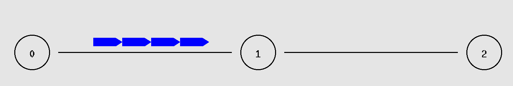
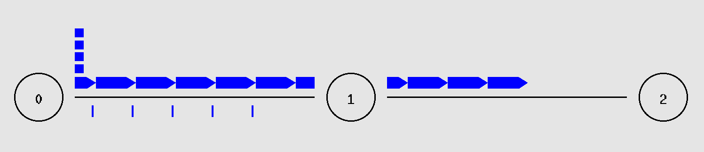
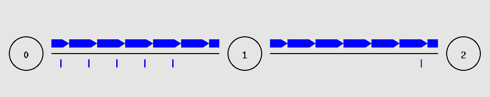
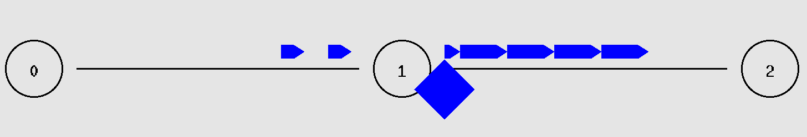
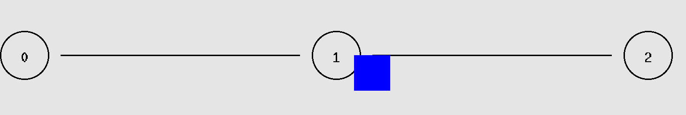

## Hands-On Exercises ##
(1) NS-2 is the most popular simulator for TCP research. It includes a package 
called NAM that can visually replay the whole simulation at all timescales. Many 
websites that introduce ns-2 can be found at [13]. Use NAM to observe a TCP running 
from a source to its destination, with and without buffer overflow at one intermediate 
router.  

**[ans]**  
```tcl
#Create a simulator object
set ns [new Simulator]

#Define different colors for data flows (for NAM)
$ns color 1 Blue
$ns color 2 Red

#Open the NAM trace file
set nf [open out.nam w]
$ns namtrace-all $nf

#Define a 'finish' procedure
proc finish {} {
        global ns nf
        global ns ftcp
        $ns flush-trace
        #Close the NAM trace file
        close $nf
        close $ftcp
        #Execute NAM on the trace file
        # exec nam out.nam &
        exit 0
}

#Create three nodes
set n0 [$ns node]
set n1 [$ns node]
set n2 [$ns node]

#Create links between the nodes
#ns duplex-link node1 node2 bandwidth delay queue-type
$ns duplex-link $n0 $n1 2Mb 50ms DropTail
$ns duplex-link $n1 $n2 1Mb 50ms DropTail

#Set Queue Size of link (n2-n3) to 10
$ns queue-limit $n1 $n2 2

#Give node position (for NAM)
$ns duplex-link-op $n0 $n1 orient right
$ns duplex-link-op $n1 $n2 orient right

#Monitor the queue for link (n2-n3). (for NAM)
$ns duplex-link-op $n0 $n1 queuePos 0.5
$ns duplex-link-op $n1 $n2 queuePos 0.5


#Setup a TCP connection
set tcp [new Agent/TCP/Reno]
$tcp set class_ 2
$ns attach-agent $n0 $tcp
set sink [new Agent/TCPSink]
$ns attach-agent $n2 $sink
$ns connect $tcp $sink
$tcp set fid_ 1


##### Trace the TCP congestion window
set ftcp [open oneflow-cwnd.tr w]
$tcp attach $ftcp
$tcp trace cwnd_

#Setup a FTP over TCP connection
set ftp [new Application/FTP]
$ftp attach-agent $tcp
$ftp set type_ FTP

#Schedule events for FTP agents
$ns at 0 "$ftp start"
$ns at 40 "$ftp stop"

#Call the finish procedure after 5 seconds of simulation time
$ns at 40 "finish"

#Run the simulation
$ns run
```

**Slow start**  
```tcl
#Create links between the nodes
#ns duplex-link node1 node2 bandwidth delay queue-type
$ns duplex-link $n0 $n1 1Mb 50ms DropTail
$ns duplex-link $n1 $n2 1Mb 50ms DropTail

#Set Queue Size of link (n2-n3) to 10
$ns queue-limit $n1 $n2 20
```
  

**Congestion Avoidance**  
  
  

-----

```tcl
#Create links between the nodes
#ns duplex-link node1 node2 bandwidth delay queue-type
$ns duplex-link $n0 $n1 2Mb 50ms DropTail
$ns duplex-link $n1 $n2 1Mb 50ms DropTail

#Set Queue Size of link (n2-n3) to 10
$ns queue-limit $n1 $n2 2
```

**Fast Retransmit**  
  

-----

**Retransmit timeout**
 

```tcl
#Create links between the nodes
#ns duplex-link node1 node2 bandwidth delay queue-type
$ns duplex-link $n0 $n1 2Mb 50ms DropTail
$ns duplex-link $n1 $n2 1Mb 50ms DropTail

#Set Queue Size of link (n2-n3) to 10
$ns queue-limit $n1 $n2 1
```

-----

(4) Linux Packet Socket is a useful tool when you want to generate arbitrary types 
of packets. Find and modify an example program to generate a packet and sniff the 
packet with the same program.  

**[ans]**  
```c
#include<stdio.h> //For standard things
#include<stdlib.h>    //malloc
#include<string.h>    //memset
#include<netinet/ip_icmp.h>   //Provides declarations for icmp header
#include<netinet/udp.h>   //Provides declarations for udp header
#include<netinet/tcp.h>   //Provides declarations for tcp header
#include<netinet/ip.h>    //Provides declarations for ip header
#include<sys/socket.h>
#include<arpa/inet.h>
 
void ProcessPacket(unsigned char* , int);
void print_ip_header(unsigned char* , int);
void print_tcp_packet(unsigned char* , int);
void print_udp_packet(unsigned char * , int);
void print_icmp_packet(unsigned char* , int);
void PrintData (unsigned char* , int);
 
int sock_raw;
FILE *logfile;
int tcp=0,udp=0,icmp=0,others=0,igmp=0,total=0,i,j;
struct sockaddr_in source,dest;
 
int main()
{
    int saddr_size , data_size;
    struct sockaddr saddr;
    struct in_addr in;
     
    unsigned char *buffer = (unsigned char *)malloc(65536); //Its Big!
     
    logfile=fopen("log.txt","w");
    if(logfile==NULL) printf("Unable to create file.");
    printf("Starting...\n");
    //Create a raw socket that shall sniff
    sock_raw = socket(AF_INET , SOCK_RAW , IPPROTO_TCP);
    if(sock_raw < 0)
    {
        printf("Socket Error\n");
        return 1;
    }
    while(1)
    {
        saddr_size = sizeof saddr;
        //Receive a packet
        data_size = recvfrom(sock_raw , buffer , 65536 , 0 , &saddr , &saddr_size);
        if(data_size <0 )
        {
            printf("Recvfrom error , failed to get packets\n");
            return 1;
        }
        //Now process the packet
        ProcessPacket(buffer , data_size);
    }
    close(sock_raw);
    printf("Finished");
    return 0;
}
 
void ProcessPacket(unsigned char* buffer, int size)
{
    //Get the IP Header part of this packet
    struct iphdr *iph = (struct iphdr*)buffer;
    ++total;
    ++tcp;
    print_tcp_packet(buffer , size);
}
 
void print_ip_header(unsigned char* Buffer, int Size)
{
    unsigned short iphdrlen;
         
    struct iphdr *iph = (struct iphdr *)Buffer;
    iphdrlen =iph->ihl*4;
     
    memset(&source, 0, sizeof(source));
    source.sin_addr.s_addr = iph->saddr;
     
    memset(&dest, 0, sizeof(dest));
    dest.sin_addr.s_addr = iph->daddr;
     
    fprintf(logfile,"\n");
    fprintf(logfile,"IP Header\n");
    fprintf(logfile,"   |-IP Version        : %d\n",(unsigned int)iph->version);
    fprintf(logfile,"   |-IP Header Length  : %d DWORDS or %d Bytes\n",(unsigned int)iph->ihl,((unsigned int)(iph->ihl))*4);
    fprintf(logfile,"   |-Type Of Service   : %d\n",(unsigned int)iph->tos);
    fprintf(logfile,"   |-IP Total Length   : %d  Bytes(Size of Packet)\n",ntohs(iph->tot_len));
    fprintf(logfile,"   |-Identification    : %d\n",ntohs(iph->id));
    //fprintf(logfile,"   |-Reserved ZERO Field   : %d\n",(unsigned int)iphdr->ip_reserved_zero);
    //fprintf(logfile,"   |-Dont Fragment Field   : %d\n",(unsigned int)iphdr->ip_dont_fragment);
    //fprintf(logfile,"   |-More Fragment Field   : %d\n",(unsigned int)iphdr->ip_more_fragment);
    fprintf(logfile,"   |-TTL      : %d\n",(unsigned int)iph->ttl);
    fprintf(logfile,"   |-Protocol : %d\n",(unsigned int)iph->protocol);
    fprintf(logfile,"   |-Checksum : %d\n",ntohs(iph->check));
    fprintf(logfile,"   |-Source IP        : %s\n",inet_ntoa(source.sin_addr));
    fprintf(logfile,"   |-Destination IP   : %s\n",inet_ntoa(dest.sin_addr));
}
 
void print_tcp_packet(unsigned char* Buffer, int Size)
{
    unsigned short iphdrlen;
     
    struct iphdr *iph = (struct iphdr *)Buffer;
    iphdrlen = iph->ihl*4;
     
    struct tcphdr *tcph=(struct tcphdr*)(Buffer + iphdrlen);
             
    fprintf(logfile,"\n\n***********************TCP Packet*************************\n");    
         
    print_ip_header(Buffer,Size);
         
    fprintf(logfile,"\n");
    fprintf(logfile,"TCP Header\n");
    fprintf(logfile,"   |-Source Port      : %u\n",ntohs(tcph->source));
    fprintf(logfile,"   |-Destination Port : %u\n",ntohs(tcph->dest));
    fprintf(logfile,"   |-Sequence Number    : %u\n",ntohl(tcph->seq));
    fprintf(logfile,"   |-Acknowledge Number : %u\n",ntohl(tcph->ack_seq));
    fprintf(logfile,"   |-Header Length      : %d DWORDS or %d BYTES\n" ,(unsigned int)tcph->doff,(unsigned int)tcph->doff*4);
    //fprintf(logfile,"   |-CWR Flag : %d\n",(unsigned int)tcph->cwr);
    //fprintf(logfile,"   |-ECN Flag : %d\n",(unsigned int)tcph->ece);
    fprintf(logfile,"   |-Urgent Flag          : %d\n",(unsigned int)tcph->urg);
    fprintf(logfile,"   |-Acknowledgement Flag : %d\n",(unsigned int)tcph->ack);
    fprintf(logfile,"   |-Push Flag            : %d\n",(unsigned int)tcph->psh);
    fprintf(logfile,"   |-Reset Flag           : %d\n",(unsigned int)tcph->rst);
    fprintf(logfile,"   |-Synchronise Flag     : %d\n",(unsigned int)tcph->syn);
    fprintf(logfile,"   |-Finish Flag          : %d\n",(unsigned int)tcph->fin);
    fprintf(logfile,"   |-Window         : %d\n",ntohs(tcph->window));
    fprintf(logfile,"   |-Checksum       : %d\n",ntohs(tcph->check));
    fprintf(logfile,"   |-Urgent Pointer : %d\n",tcph->urg_ptr);
    fprintf(logfile,"\n");
    fprintf(logfile,"                        DATA Dump                         ");
    fprintf(logfile,"\n");
         
    fprintf(logfile,"IP Header\n");
    PrintData(Buffer,iphdrlen);
         
    fprintf(logfile,"TCP Header\n");
    PrintData(Buffer+iphdrlen,tcph->doff*4);
         
    fprintf(logfile,"Data Payload\n");  
    PrintData(Buffer + iphdrlen + tcph->doff*4 , (Size - tcph->doff*4-iph->ihl*4) );
                         
    fprintf(logfile,"\n###########################################################");
}
 
 
void PrintData (unsigned char* data , int Size)
{
     
    for(i=0 ; i < Size ; i++)
    {
        if( i!=0 && i%16==0)   //if one line of hex printing is complete...
        {
            fprintf(logfile,"         ");
            for(j=i-16 ; j<i ; j++)
            {
                if(data[j]>=32 && data[j]<=128)
                    fprintf(logfile,"%c",(unsigned char)data[j]); //if its a number or alphabet
                 
                else fprintf(logfile,"."); //otherwise print a dot
            }
            fprintf(logfile,"\n");
        } 
         
        if(i%16==0) fprintf(logfile,"   ");
            fprintf(logfile," %02X",(unsigned int)data[i]);
                 
        if( i==Size-1)  //print the last spaces
        {
            for(j=0;j<15-i%16;j++) fprintf(logfile,"   "); //extra spaces
             
            fprintf(logfile,"         ");
             
            for(j=i-i%16 ; j<=i ; j++)
            {
                if(data[j]>=32 && data[j]<=128) fprintf(logfile,"%c",(unsigned char)data[j]);
                else fprintf(logfile,".");
            }
            fprintf(logfile,"\n");
        }
    }
}
```

```txt
***********************TCP Packet*************************

IP Header
   |-IP Version        : 4
   |-IP Header Length  : 5 DWORDS or 20 Bytes
   |-Type Of Service   : 0
   |-IP Total Length   : 52  Bytes(Size of Packet)
   |-Identification    : 52101
   |-TTL      : 51
   |-Protocol : 6
   |-Checksum : 6198
   |-Source IP        : 192.30.252.87
   |-Destination IP   : 140.113.27.33

TCP Header
   |-Source Port      : 443
   |-Destination Port : 51406
   |-Sequence Number    : 705023644
   |-Acknowledge Number : 4206533842
   |-Header Length      : 8 DWORDS or 32 BYTES
   |-Urgent Flag          : 0
   |-Acknowledgement Flag : 1
   |-Push Flag            : 0
   |-Reset Flag           : 0
   |-Synchronise Flag     : 0
   |-Finish Flag          : 0
   |-Window         : 31
   |-Checksum       : 56357
   |-Urgent Pointer : 0

                        DATA Dump                         
IP Header
    45 00 00 34 CB 85 40 00 33 06 18 36 C0 1E FC 57         E..4..@.3..6...W
    8C 71 1B 21                                             .q.!
TCP Header
    01 BB C8 CE 2A 05 CE 9C FA BA 9C D2 80 10 00 1F         ....*.......�...
    DC 25 00 00 01 01 08 0A 62 48 06 8B 00 57 72 8C         .%......bH...Wr.
Data Payload

###########################################################
```

-----

(8) What transport protocols are used in MS Media Player or RealMedia? Please 
use Wireshark to observe and find out the answer.  

**[ans]**  
HTTP, RTSP(Real Time Streaming Protocol), PNS(Progressive Network Streaming Protocol) 

## Written Exercises ##

(4) Consider that a mobile TCP receiver is receiving data from its TCP sender, 
what will the smoothed RTT and the RTO evolve when the receiver gets farer and 
then nearer? Assume the moving speed is very fast such that the propagation delay 
ranges from 100 ms to 300 ms within 1 second.  

**[ans]**  

```
R': a new RTT
SRRT: smoothed round-trip time
RTTVAR: round-trip time variation
alpha = 0.125
beta = 0.25

RTTVAR <- (1 - beta) * RTTVAR + beta * |SRTT - R'|
SRTT <- (1 - alpha) * SRTT + alpha * R'
RTO <- SRTT + max (G, K*RTTVAR)
```
> The difference(RTTVAR) between SRTT and R' will increase,  
> so RTO will increase too

-----
(6) Given that the throughput of a TCP connection is inversely proportional to 
its RTT, connections with heterogeneous RTTs sharing the **same queue will get 
different bandwidth** shares. What will be the eventual proportion of the bandwidth 
sharing among three connections if their propagation delays are 10 ms, 100 ms, 
150 ms, and the service rate of the shared queue is 200 kbps? Assume that the 
queue size is infinite without buffer overflow (no packet loss), and the max 
window of the TCP sender is 20 packets, with each packet having 400 bytes. (1k=1000)   

**[ans]**  
> Assume heterogeneous RTTs sharing the same queue: **q**  
> q / 10(ms) + q / 100(ms) + q / 150(ms) = 200 * 1000 byte/sec = 200 byte/ms  
> q = 1714.2857143836734 ~= 1714.3 
> => 171.43, 17.143, 11.43 (byte/ms)

-----

(8) If the smoothed RTT kept by the TCP sender is currently 30 msec and the 
following measured RTT are 26, 32, and 24 msec, respectively. What is the new 
RTT estimate?  

**[ans]**  
`SRTT <- (1 - alpha) * SRTT + alpha * R'`
> after 26, SRTT = (1 - 0.125) * 30 + 0.125 * 26 = 29.5  
> after 32, SRTT = (1 - 0.125) * 29.5 + 0.125 * 32 = 29.8125  
> after 24, SRTT = (1 - 0.125) * 29.8125 + 0.125 * 24 = 29.0859375

-----

(13) Suppose you are going to design a real-time streaming application over the 
Internet that employs RTP on top of TCP instead of UDP, what situations will the 
sender and the receiver encounter in each TCP congestion control state shown in 
Figure 5.21? Compare your expected situations with those designed on top of UDP 
in a table format.  

**[ans]**  
> * **TCP**:
>   * **Slow Start**
>     * The sender increases `cwnd` exponentially by adding one packet
to `cwnd` each time it receives an ACK, so `cwnd` is doubled.
>   * **Congestion Avoidance**
>     * This state begins when `cwnd` >= `ssth`
>     * `cwnd` will grow linearly(slowly) by add `1 / cwnd` packet each time
>   * **Fast Retransmission**
>     * `cwnd` will reset to 1, then go back to **Slow Start**
>   * **Retransmission Timeout**
>     * `cwnd` will reset to 1, then go back to **Slow Start**

> * **UDP**:
>   * **Slow Start**
>     * only limited by bandwidth and hardware's capability
>   * **Congestion Avoidance**
>     * only limited by bandwidth and hardware's capability
>   * **Fast Retransmission**
>     * no retransmission mechanism
>   * **Retransmission Timeout**
>     * no retransmission mechanism


-----

(16) The text spends a great amount of pages introducing the different versions 
of TCP. Identify three more TCP versions by searching Itemize them and highlight 
their contributions within three lines of words with each TCP version.  

**[ans]**  
> * **FAST TCP (also written FastTCP)**: long-distance, high latency links
> * **TCP Vegas**: emphasizes packet delay, rather than packet loss, as a signal 
to help determine the rate at which to send packets.
> * **TCP Hybla**: eliminate penalization of TCP connections that incorporate a 
high-latency terrestrial or satellite radio link.


