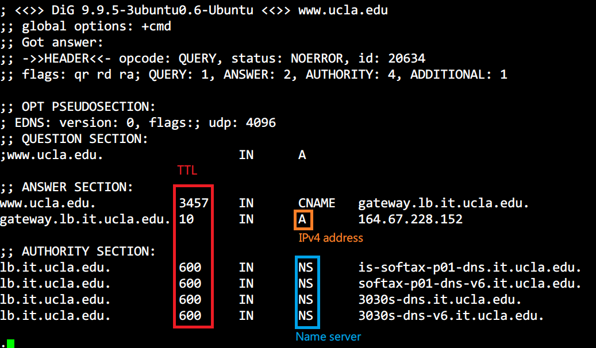
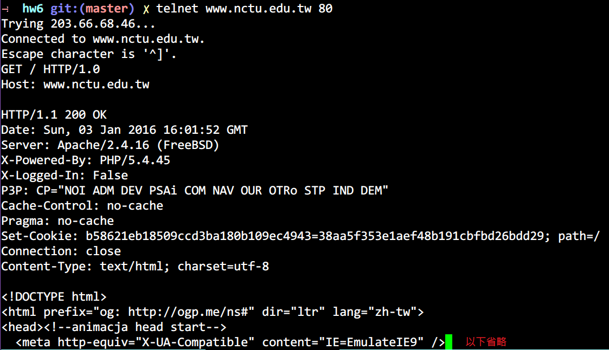

## Hands-On Exercises
(1) Read first the “dig” manual of BIND9 (including the later versions), especially the
“+trace” and “+recursive” options, and answer the following questions.
(a) A query generated by dig is by default a recursive query (so that a local name 
server continues the query on behave of the client). Why is it used by dig (or resolver 
routines in other applications)? Also issue a recursive query to www.ucla.edu, and 
explain each RR in all five sections of the reply.
(b) Describe each consulted name servers in an iterative query for www.ucla.edu 
using dig.  

**[ans]**  
> (a) When use recursive query mode between `Client` and `Local name server`, `Local name server` 
will cache query result in its dataset; Without that, only `Client` will know the answer.
And `Local name server` will use iterative query mode between others NS.  

  
`TTL` means that how many time to update. (e.g. if change mapping ip address NS 
need `TTL` times to update)  

> (b) Local name server -> (.) root-servers.net.  
     Local name server -> (edu.) edu-servers.net.  
     Local name server -> (ucla.edu.) dns.ucla.edu.  

-----

(3) Read first the SMTP and POP3 commands. Then telnet to your SMTP server (port 25) 
and send a message to yourself. After that, telnet to your POP3 server (port 110) 
and retrieve the message. Record everything that happens on the sessions.  

**[ans]**  

**SMTP**  
```
Trying 127.0.0.1...
Connected to localhost.
Escape character is '^]'.
220 yehya-lab Python SMTP proxy version 0.3
HELO www.nctu.edu.tw
250 yehya-lab
MAIL FROM:<smail2140@gmail.com>
250 OK
RCPT TO:<wdv4758h@gmail.com>
250 OK
DATA
im a data
FROM:smail2140@gmail.com
TO:<wdv4758h@gmail.com>
Subject:im a subject
test mail test mail test mail test mail test mail test mail test mail
 test mail test mail test mail test mail test mail test mail test mail
final of the mail
.
QUIT

```

**POP3**  
```
$ telnet mail.popserver.com 110
Trying 192.168.0.100
Connected to mail.popserver.com.
Escape character is '^]'.
+OK <21860.1076718099@mail.popserver.net>
user USERNAME
+OK
pass PASSWORD
+OK
list
1 3713
2 83815
3 6180
4 3813
5 2177
6 4134
7 7168
8 18234
.
retr 1
+OK ???? octets
[[message]]
.
dele 1
+OK
quit
+OK
Connection closed by foreign host.
```

-----

(5) Telnet to your Web server (port 80) and get a document using HTTP 1.0. Observe
the HTTP response headers. Record everything that happens in the session.  

**[ans]**  
  

## Written Exercises
(5) What RRs may be used in the following situations? Explain each of them using an
example.  
a) In the process of a forward query.  
b) In the process of a reverse query.  
c) Resolve the domain name B, which is an alias of domain name A.  
d) In mail forwarding.  

**[ans]**  
> (a) SOA, NS, A  
> (b) PTR  
> (c) CNAME  
> (d) MX  

-----

(7) Webmail is Web browser based and includes support for POP3 and IMAP4. Describe
the differences between POP3 based webmail and IMAP4 based webmail.  

**[ans]**  
> IMAP4 allows messages to be stored and manipulated on mail system while POP3 
only allows user to download their messages and store, manipulate messages on the 
users machines.  

-----

(16) Describe the processes of setting up an active and a passive connection for FTP,
respectively (including the command and parameters used). Assume that the control 
connection has already been established on port 21.  

**[ans]**  
> * control connection has already been established on port 21 
>   * by USER $username => PASS $passwd
> * Active mode
>   * client will tell server IP (h1.h2.h3.h4) and port number (p1*256+p2)
>   * then wait for the server to connect this socket.
> * Passive mode
>   * vice versa


-----

(26) How do the audio and video messages get synchronized in streaming?  

**[ans]**  
> Intra-stream synchronization  
> Inter-stream synchronization  
> Inter-object synchronization  


