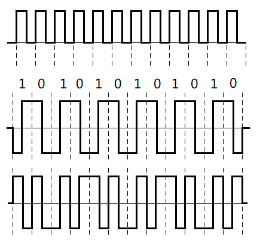
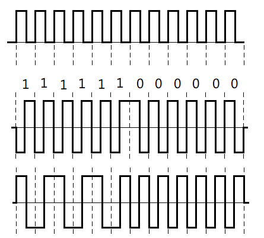
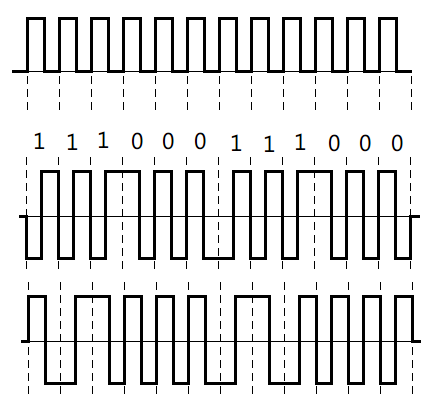
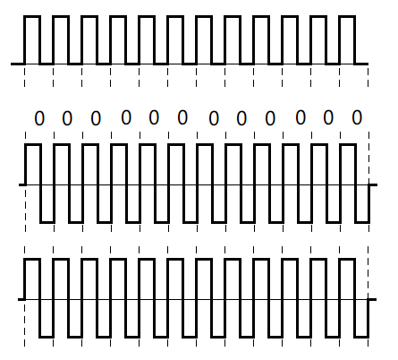
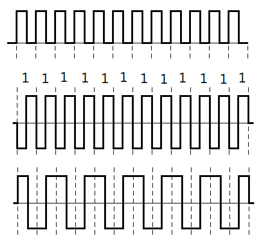

## Hands-On Exercises ##

### [1] Find and summarize the network-related modules ###
#### protocol layer ####

#### purpose ####

#### programming language ####

#### key implement alg. or mechanisms ####

## Written Exercises ##

2. Compare the number of required frequencies and the size of bandwidth to represent 
the following signals: (a) periodic analog, (b) aperiodic analog, (c) periodic 
digital, and (d) aperiodic digital. 

**[Ans 2]**
> (a) periodic analog: one discrete frequency

> (b) aperiodic analog: bandwidth-limited continuous spectrum

> (c) periodic digital: infinite continuous frequency

> (d) aperiodic digital: bandwidth-unlimited continuous spectrum

-----

7. Among unipolar NRZ-L, Polar NRZ-L, NRZ-I, and RZ, Manchester, differential 
Manchester, AMI, and MLT-3, which schemes have no issues on synchronization, 
baseline wandering, and DC components, respectively? 

**[Ans 7]**
> **self-synchronization problem:** unipolar NRZ-L, polar NRZ-L, polar NRZ-I, AMI, MLT-3

> **baseline wandering problem:** unipolar NRZ-L, polar NRZ-L, polar NRZ-I, MLT-3

> **DC components problem:** unipolar NRZ-L, polar NRZ-L, polar NRZ-I, MLT-3

-----

9. Draw the waveforms using the schemes of Manchester and differential Manchester 
for the following data streams. Calculate the value of sdr (signal-to-data ratio) 
and the average baud rate.  
a.  101010101010  
b.  111111000000  
c.  111000111000  
d.  000000000000  
e.  111111111111  

**[Ans 9]**
> (a) 101010101010  
> **sdr:** sdr=2  
> **avg baud rate:** bit rate  

> (b) 111111000000
> **sdr:** sdr=2  
> **avg baud rate:** bit rate  

> (c) 111000111000
> **sdr:** sdr=2  
> **avg baud rate:** bit rate  

> (d) 000000000000
> **sdr:** sdr=2  
> **avg baud rate:** bit rate  

> (e) 111111111111
> **sdr:** sdr=2  
> **avg baud rate:** bit rate  

-----

11. Given a data stream of a bit rate 1 Mbps, 2 Mbps, or 54 Mbps, calculate the 
baud rate using the modulation of BFSK, BASK, BPSK, QPSK, 16-PSK, 4-QAM, 16-QAM, 
and 64QAM. 

**[Ans 11]**

ans unit: MBd

|         | BFSK | BASK | BPSK | QPSK | 16-PSK | 4-QAM | 16-QAM | 64QAM |
|---------|------|------|------|------|--------|-------|--------|-------|
|  1 Mbps |     1|     1|     1|   0.5|    0.25|    0.5|    0.25|  0.167|
|  2 Mbps |     2|     2|     2|     1|     0.5|      1|     0.5|  0.333|
| 54 Mbps |    54|    54|    54|    27|    13.5|     27|    13.5|      9|

-----

15. Compare the PN codes and the orthogonal codes used in CDMA. Why can we support 
more users with PN codes than with orthogonal codes? 

**[Ans 15]**
> asynchronous CDMA is more efficient in allocating PN codes to more users.

-----

21. What are the criteria for two signals to be orthogonal to each other in OFDM? 

**[Ans 21]**
> Two signals that cross-over at the point of zero amplitude are orthogonal 
> to each other.

